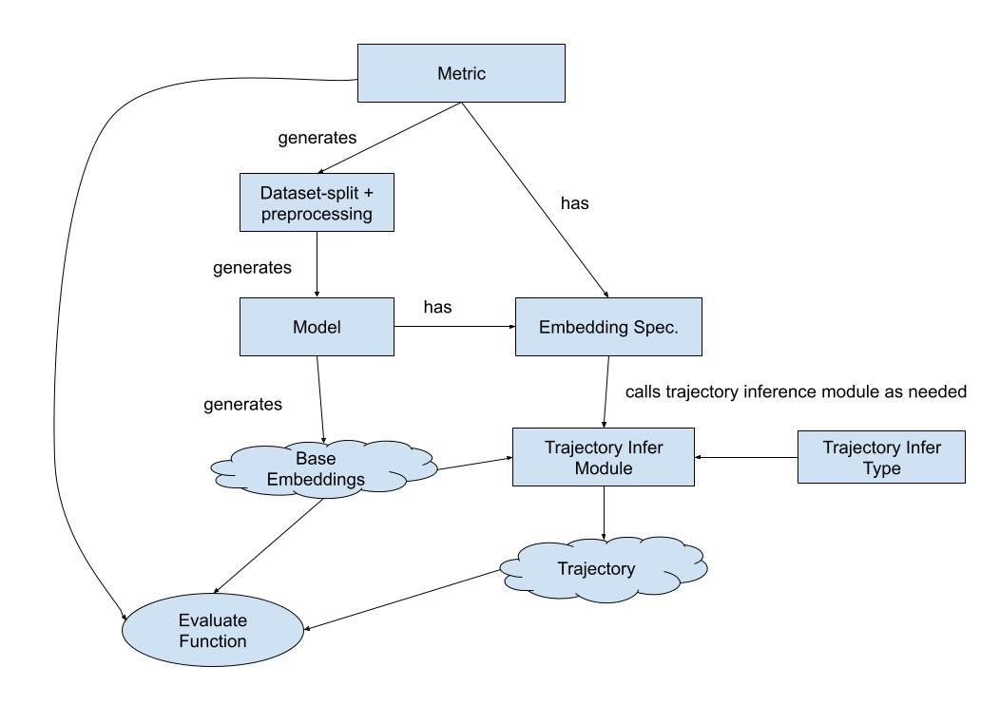

# Crispy-Fishstick
## Architecture

The benchmark architecture will follow:

1. The metric class will be the class that initiates everything. It specifies what its dataset split is, which will be used to generate the model.
2. The metric class also has a model prediction/embedding specification of what it requires, and each model has a list of predictions it can provide. If the metric is not a subset of the model's prediction specifications, this will result in a warning.
3. Each embedding specification/prediction specification will have a module that will manipulate the base prediction embeddings for trajectory inference.
4. Based on the base predictions and trajectories, the metric will have separate evaluation functions.

The users will need to provide a script for the model class to train based on given dataset splits. We will also provide a database for this to run in at the end.
