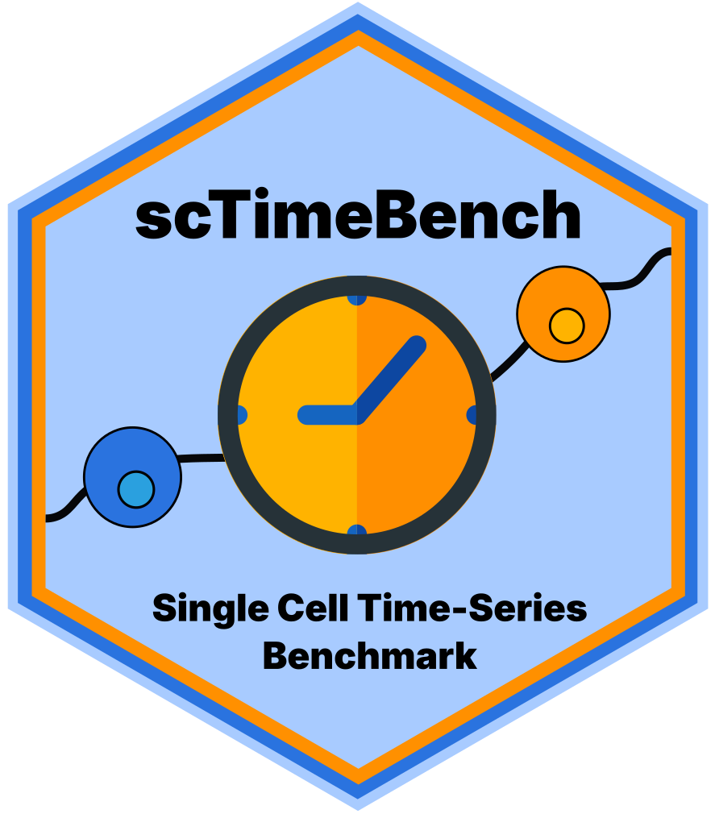
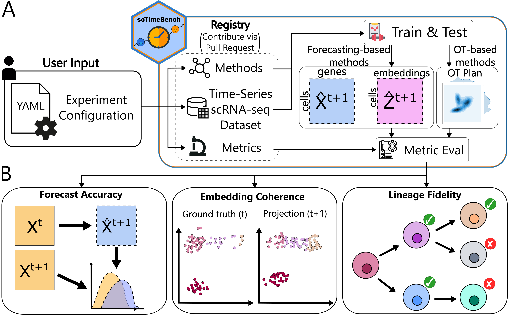
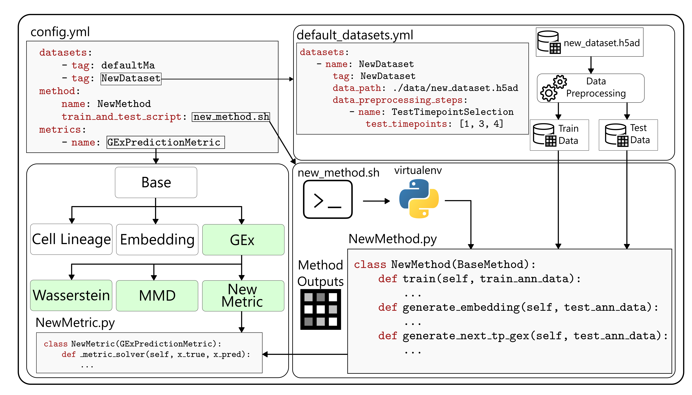

<h1>
	 scTimeBench
</h1>

[](https://www.python.org/downloads/release/python-31012/)
[](https://opensource.org/license/mit)
[](https://www.biorxiv.org/content/10.64898/2026.03.16.712069v1)
[](https://colab.research.google.com/drive/1J-yNXu_FcSnhrCwTDQKjWCBSHsmdbohJ?usp=sharing)
<!-- TODO: --> <!-- []() -->




## Table of Contents
- [Environment Setup](#environment-setup)
  - [Suggested UV Installation](#suggested-uv-installation)
  - [Standard Pip](#standard-pip)
- [Benchmark Architecture](#benchmark-architecture)
  - [Detailed Layout of File Structure](#detailed-layout-of-file-structure)
  - [Command-Line Interface Details](#command-line-interface-details)
  - [Example Run](#example-run)
- [Contributing to scTimeBench](#contributing-to-sctimebench)
- [Citation](#citation)

## Environment Setup
scTimeBench was tested and supported using Python 3.10. If any other version that is 3.10+ does not work when using the benchmark, please submit an issue to this GitHub.

Important Note: this setup is needed twice. Once for the user to run the benchmark metrics, and the second time for the method itself needing to read from `scTimeBench.method_utils.method_runner` and other important shared constants. In short, this means we need to install scTimeBench into two separate virtual environments:
1. Your normal pip installation where you'll be running the benchmark from. This will require the extra "\[benchmark\]" group installation (pip) or the extra group installation `--extra benchmark` (uv).
2. For each method's virtual environment, you need to install the scTimeBench.

### Suggested UV Installation
Due to external dependencies and a more complex setup, we have decided to package everything under `uv` (see: https://github.com/astral-sh/uv). To start with, you need to get all the necessary extern dependencies, which can be done either by running:
```
git submodule update --init extern/
```
If you wish to benchmark across all methods, feel free to clone the submodules for all the methods as well with:
```
git submodule update --init
```
Then, install `uv` and run the following:
```
uv sync --extra benchmark
```
If you're using uv under a method's virtual environment, either the pip installation or the following will suffice:
```
uv sync
```

### Standard Pip
If the external dependencies such as pypsupertime or sceptic are not used (which they are not used by default), you can install using pip as follows:
```
pip install -e ".[benchmark]"
```
to run the benchmark. For your own method, simply install without the extra benchmarking requirements with
```
pip install -e .
```
There are extra dependencies that can be found under `pyproject.toml`.

## Benchmark Architecture

scTimeBench is controlled by a central configuration file which determines which datasets, methods, and metrics to run. An example of this can be found under `configs/scNODE/gex.yaml`.

### Detailed Layout of File Structure
* `configs/`: possible yaml config files to use as a starting point
* `extern/`: external packages that required edits for compatability such as pyPsupertime and Sceptic.
* `methods/`: the different methods that are possible to use, including defined submodules. Add your own methodology here.
* `src/`: where the scTimeBench package lies. See `src/ReadMe.md` for more documentation on the modules that exist there.
* `test/`: unit tests for each method, dataset, metric, and other important modules.

### Command-Line Interface Details
The entrypoint for the benchmark is defined as `scTimeBench`. Run `scTimeBench --help` for more details, or refer to `src/scTimeBench/config.py` and the documentation.

### Example Run
Run the package with:
```
scTimeBench --config configs/scNODE/gex.yaml
```

For a full running example using scNODE, refer to our example [Jupyter Notebook](https://colab.research.google.com/drive/1J-yNXu_FcSnhrCwTDQKjWCBSHsmdbohJ?usp=sharing).

## Contributing to scTimeBench
If you want to contribute, please install the dev environments with:
```
uv sync --extra dev --extra benchmark
```
or
```
pip install -e ".[dev, benchmark]"
```

To enable the autoformatting, please run:
```
pre-commit install
```
before committing.

Follow our example tutorials on adding new methods, datasets, and metrics in our documentation here: TODO-ADD-THIS.

### Testing
If your change heavily modifies the architecture, please run the necessary tests under the `test/` environment using pytest. Read more on the different available tests under `test/ReadMe.md`. See more information on the pytest documentation: https://docs.pytest.org/en/stable/. A useful flag is `-s` to view the entire output of the test.

## Citation
```bibtex
@article {scTimeBench,
	author = {Osakwe, Adrien and Huang, Eric Haoran and Li, Yue},
	title = {scTimeBench: A streamlined benchmarking platform for single-cell time-series analysis},
	elocation-id = {2026.03.16.712069},
	year = {2026},
	doi = {10.64898/2026.03.16.712069},
	publisher = {Cold Spring Harbor Laboratory},
	URL = {https://www.biorxiv.org/content/early/2026/03/18/2026.03.16.712069},
	eprint = {https://www.biorxiv.org/content/early/2026/03/18/2026.03.16.712069.full.pdf},
	journal = {bioRxiv}
}
```
